# 16-761 Assignment 2: Sensor Simulator and Mapping

Goals: In this assignment, you will implement a sensor
simulator for a 3D depth camera as well as an occupancy
grid mapper in 3D.

### Academic Integrity
1. Do not publicly share your solution (using GitHub or otherwise)
2. Collaboration is encouraged but you should write final code on your own.
3. No AI tools may be used to complete this assignment. This includes
but is not limited to Copilot, ChatGPT, Perplexity AI, and Cursor AI.

## 0. Setup
Create a python virtual environment.
```python
python3.8 -m venv .venv
```
Source the environment
```python
source .venv/bin/activate
```
You will need to install the following dependencies.
```python
pip install scipy pyyaml numpy matplotlib scikit-learn open3d opencv-python plyfile
```
Download the assignment.
```bash
git clone git@github.com:mr-cmu/assignment2-handout.git
```
Note: if the above command results in a `Permission denied (public key)`
error, then try setting up an SSH key in your Github account using the
instructions [here](https://docs.github.com/en/authentication/connecting-to-github-with-ssh/adding-a-new-ssh-key-to-your-github-account).

If the cloning still does not work, use
```bash
git clone https://github.com/mr-cmu/assignment2-handout.git
```

**IMPORTANT:** Please replace the `utils` directory with your
solutions from assignment0. The functions you write in this assignment
depend on completion of the previous assignment.

## 1. Sensor Simulator (60 points)
The sensor simulator is contained in `quadrotor_simulator_py`. You
will implement functions in this folder, zip your folder, and upload
to Autolab for grading.

Test data and expected solutions are available for local testing.

To receive full credit on this portion of the assignment,
you will need to implement the following functions:

* `ray_triangle_intersect` (20 points)
* `transform_to_camera_frame` (20 points)
* `project_to_image_plane` (20 points)

There are local tests provided for each of these functions in
`test/test_sensor_simulator.py`.

### 1.1 `ray_triangle_intersect` (20 points)
To be able to test your mapping algorithms in simulation, you need to
be able to create a sensor model and perform a ray intersection with
the environment. For this assignment, we have provided the mesh as
PLY file in the `mesh` directory. This mesh consists of triangular
faces only, so we can perform a ray-mesh intersection using the
Möller–Trumbore ray-triangle intersection algorithm.

In this function, you will write the code to this intersection.
There are local tests for this function. The output of your
function should match the image below.

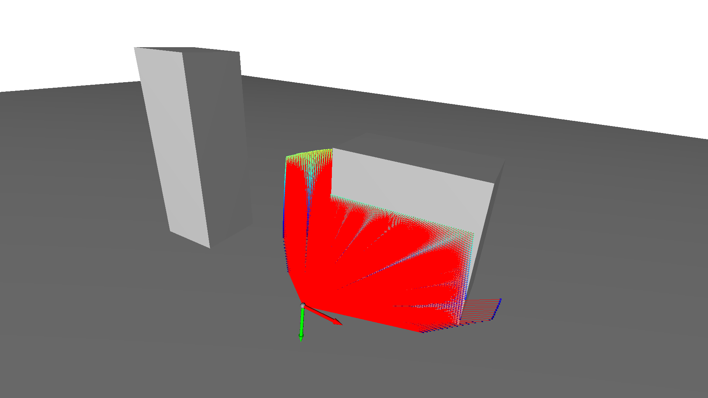
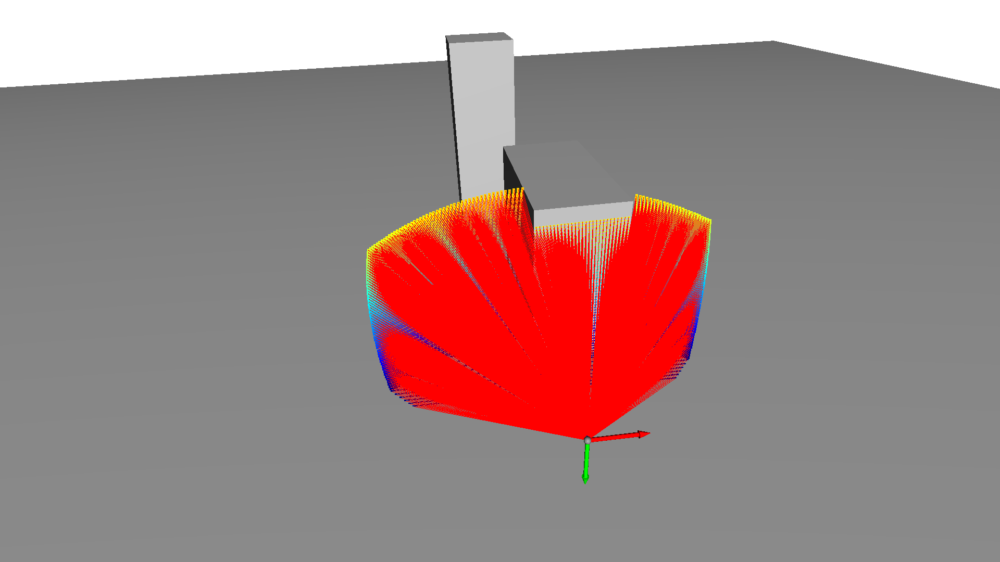

### 1.2 `transform_to_camera_frame` (20 points)
This function takes points in the world frame and converts them to the
camera frame. This is the output we would get directly from our
sensor.

There are local tests for this function. The output of your
function should match the image below.

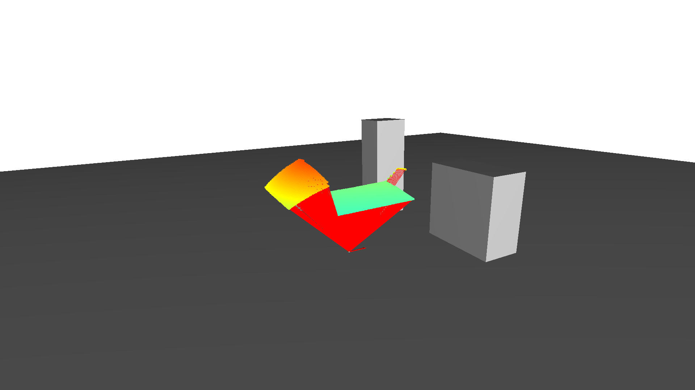
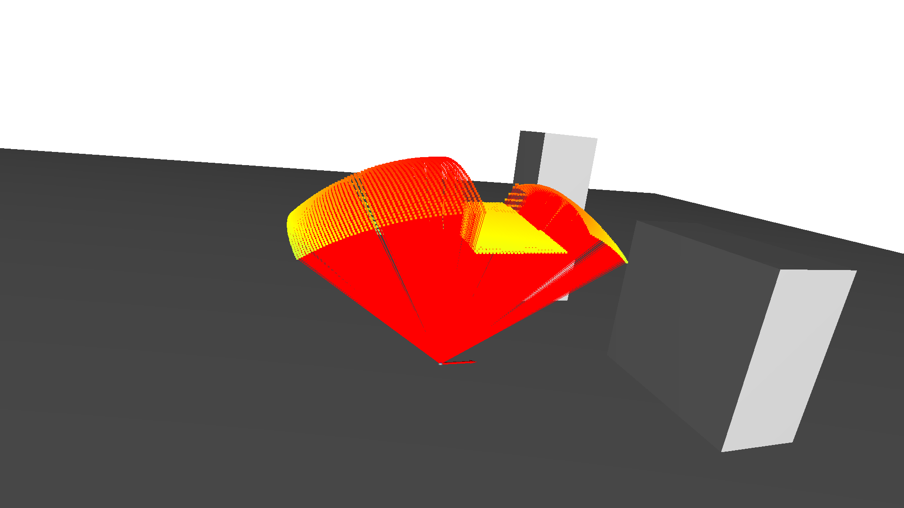

### 1.3 `project_to_image_plane` (20 points)
This function projects the camera frame points to a depth image.

There are local tests for this function. The output of your
function should match the image below.

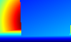
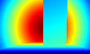

## 2. Mapping (40 points)
You will need to write the following functions:

* `update_logodds`
* `logodds`
* `probability`
* `index2cell`
* `cell2index`
* `point2cell`
* `cell2point`
* `add_ray`

Detailed instructions for the contents of each function follow. There
is a local test provided to test the correctness of your
implementation in `test/test_occupancy_grid.py`.

### 2.1 `update_logodds`
Updates the log odds value of a cell depending on wehther a hit
or miss update is supplied. The value passed in should be added
to the existing value in the cell.

### 2.2 `logodds`
Calculate the log odds representation of the supplied probability value.

### 2.3 `probability`
Calculate the probability of the supplied log odds value.

### 2.4 `index2cell`
Calculate whether the supplied cell lies within the grid extents.

### 2.5 `cell2index`
Convert the supplied cell to an index value in the grid data vector.

### 2.6 `cell2point`
Converts the cell to the corresponding world frame point in the grid.

### 2.7 `point2cell`
Converts the point in the world frame to the corresponding cell
in the grid.

### 2.8 `add_ray`
Gets the list of cells that intersect the line segment defined by the
start and end points, which are both specified in the world
frame. Determine whether the ray is over length. If it is, the last
cell is free; otherwise, it needs to be updated as occupied.  You can
use the max range parameter in order to make this determination. You
should also use the update miss and update hit functions in your
solution

### 2.9 Checking your solutions
There is a local test you can run in `test_occupancy_grid.py`. When
you run it, you will see multiple visualizations pop up. The
visualizations will show you the sensor poses with the world frame
points plotted on the mesh, the occupied cells your code produces, and
the combined free and occupied cells your code produces. You will get
a score based on the correct number of free and occupied cells your
solution computes.

#### Test 1 Results
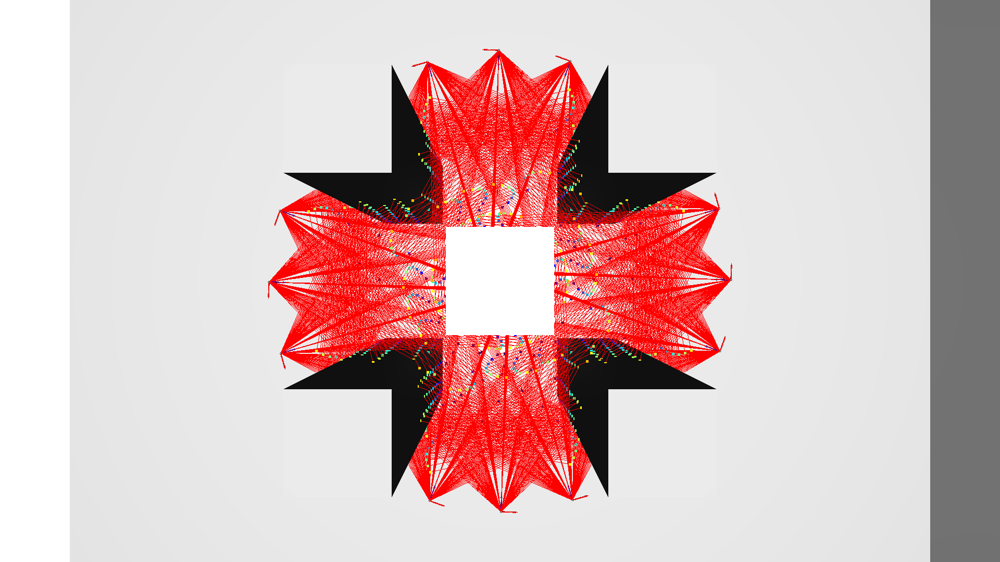
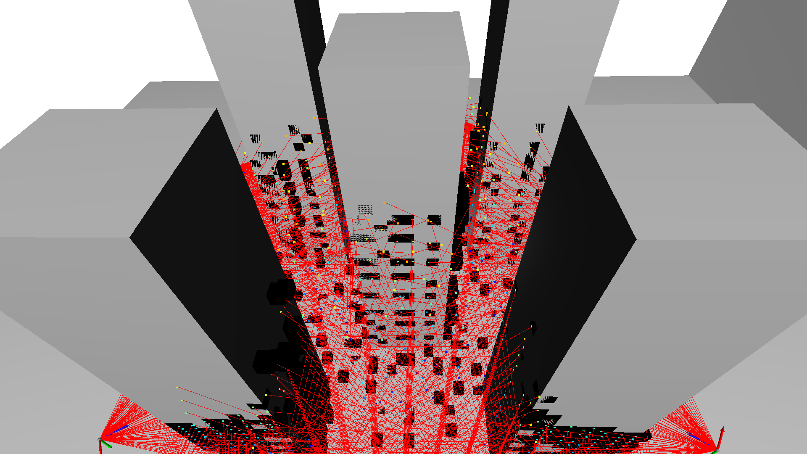
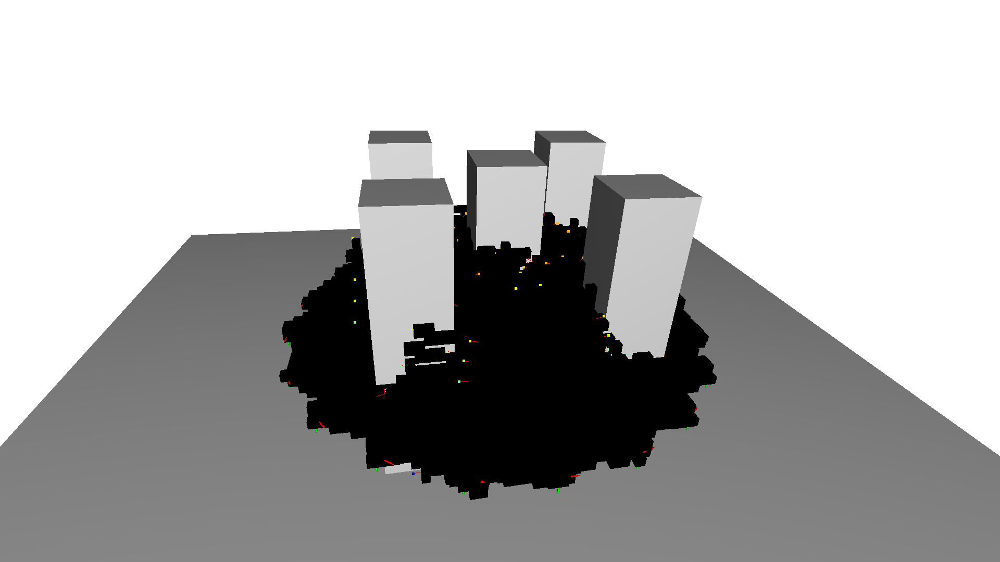

#### Test 2 Results

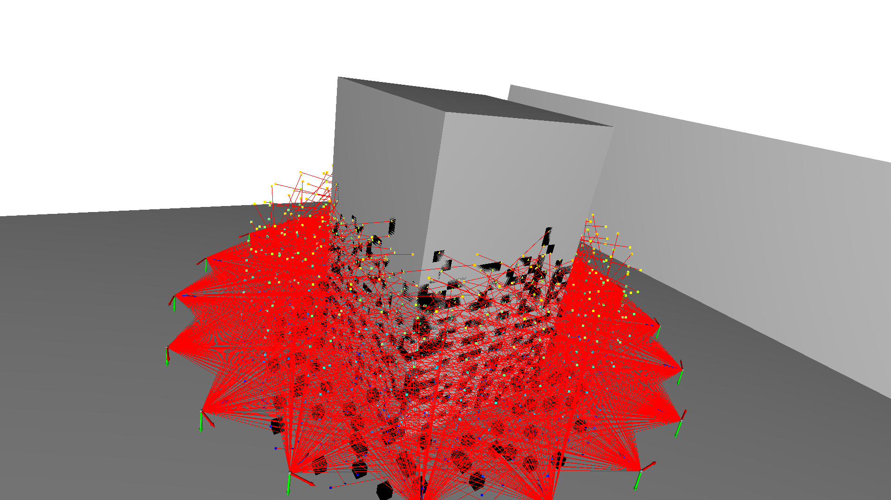
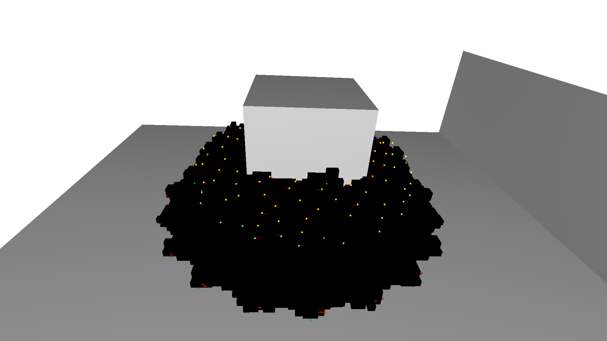

**IMPORTANT**: Take care that your point, cell, and index lie within
the grid extents. Unexpected raytracing behavior will occur if you do
not properly handle these conditions.

## 4. Grading with AutoLab
To have your solutions graded, you will need to tar the `quadrotor_simulator_py`
folder and upload to autolab.

```
cd assignment2-handout
tar -cvf handin.tar quadrotor_simulator_py
```

Autolab will run tests on each function you implement and you will
receive a score out of 100.  You may upload as many times as you like.
Note that we may regrade submissions after the deadline passes.
